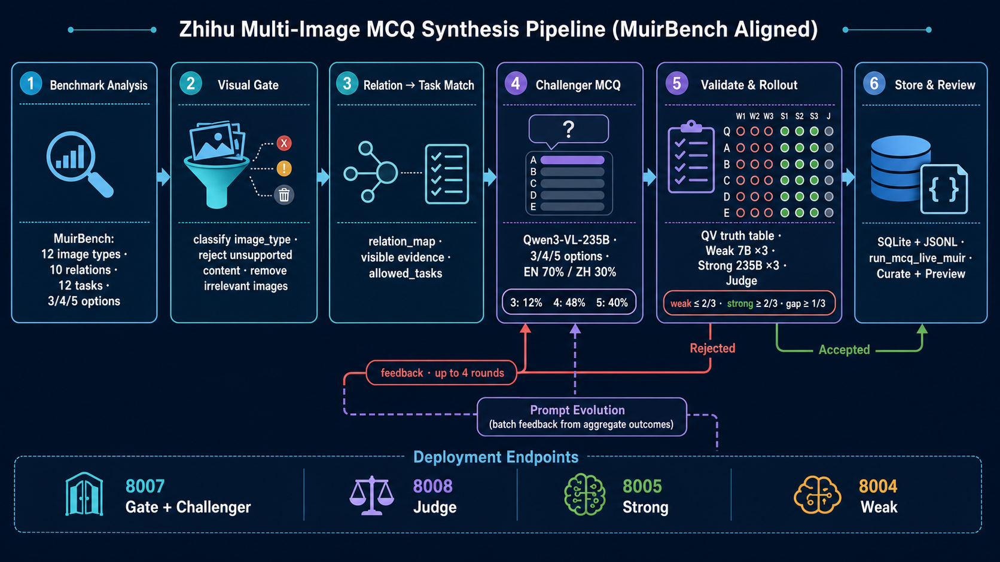
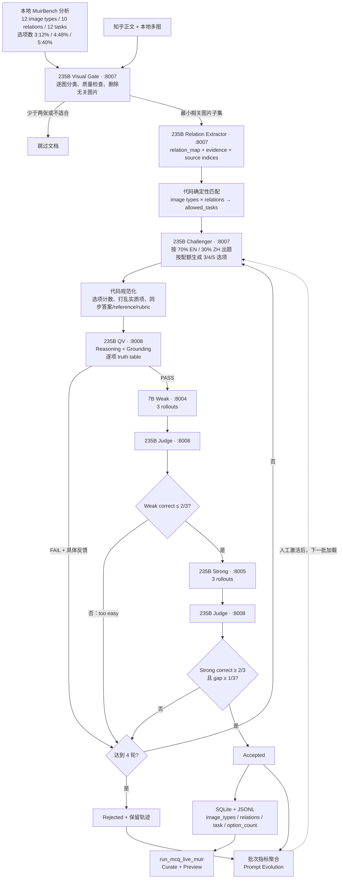
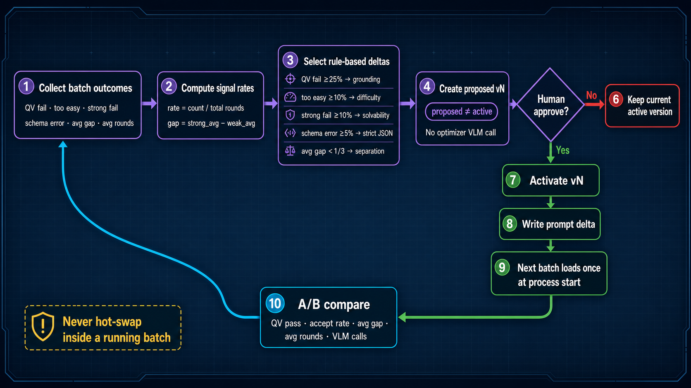

# Zhihu 多图 MCQ 数据合成技术报告

> 文档版本：2026-07-23  
> 系统：AutoData Studio / Agentic Self-Instruct  
> 任务：知乎多图语料 → MuirBench-aligned 三/四/五选 MCQ  
> 当前独立前端数据集：`run_mcq_live_muir`

## 1. 目标与验收标准

系统从知乎回答的正文和配图中，筛选适合多图推理的素材并生成选择题。当前版本不再固定五选一，
而是依据本地 MuirBench 分布生成 3、4、5 个选项，其中四选题最多。

一条 accepted 样本必须同时满足：

- 图片属于 MuirBench 覆盖的视觉类型，且无关图片已经移除；
- 题目属于图片类型和跨图关系共同允许的任务；
- 至少需要联合观察两张图片，不能凭单图或世界知识直接回答；
- 实质选项只有一个被图片支持，其余选项均被图片反驳；
- 最后一个选项的 `none_of_above` 或 `insufficient_evidence` 语义正确；
- Strong 模型稳定可解，Weak 模型不能稳定答对，并满足能力 gap；
- 图片、题干、选项、答案、reference、rubric 和元数据内部一致。

系统先利用 Benchmark 统计约束数据空间，再执行 Visual Gate、关系抽取、题型匹配、出题、
QV、Weak/Strong rollout 和 Judge 验收。失败原因既用于当前样本重试，也用于批次级 Prompt Evolution。

## 2. 总体架构



> 上图由 GPT Image 生成，展示当前生产流程、模型端点和两级反馈闭环。精确字段和门槛以本文及代码为准。



### 2.1 各模型的角色

| 角色 | 模型与端点 | 职责 |
|---|---|---|
| Visual Gate / Relation Extractor | Qwen3-VL-235B，`:8007` | 过滤素材、识别 MuirBench 图片类型与跨图关系、建立可见证据边界 |
| Challenger | Qwen3-VL-235B，`:8007` | 在 `allowed_tasks` 内生成题干、变长选项、候选答案、reference 和 rubric |
| QV / Judge | Qwen3-VL-235B，`:8008` | QV 检查推理与 grounding；Judge 对 Weak/Strong 每次 rollout 判 0/1 |
| Weak Solver | Qwen2.5-VL-7B，`:8004` | 提供难度下界，防止题目过于简单 |
| Strong Solver | Qwen3-VL-235B，`:8005` | 验证题目对强视觉模型稳定可解 |

`57741` 的 8 卡机器拆成两个 TP4 的 235B 服务，分别承载生成/门控和 QV/Judge，以减少单端点排队；
Strong 和 Weak 独立部署，使 rollout 负载不会阻塞 Challenger。

## 3. Benchmark 结合分析

### 3.1 本地 MuirBench 数据结论

对 `../muirbench` 原始数据的分析结果如下，完整报告见
[MUIRBENCH_DATA_ANALYSIS_REPORT.md](MUIRBENCH_DATA_ANALYSIS_REPORT.md)。

| 统计项 | 结果 |
|---|---|
| 总样本 | 2,600，包含 1,300 个 answerable 与 1,300 个配对 unanswerable |
| 图片总量 | 11,264，平均约 4.3 张/题 |
| 图片类型 | 12 类 |
| 跨图关系 | 10 类 |
| MCQ 任务 | 12 类 |
| 选项数量 | 3 个：308（11.85%）；4 个：1,256（48.31%）；5 个：1,036（39.85%） |

任务分布以 Image-Text Matching、Diagram Understanding、Difference Spotting、
Visual Retrieval 和 Counting 为主，同时覆盖 Attribute Similarity、Scene Understanding、
Action Understanding、Geographic Understanding、Visual Grounding、Cartoon Understanding 和 Ordering。

主要数据来源包括 SEED-Bench、IconQA、SciDuet、University、PubMed、GeNeCIS、NLVR2、
ISVQA、MMBench、HistoricalMap 和 HallusionBench。Diagram 类全部来自 IconQA，
因此在迁移到知乎图片时不能只复刻模板，还必须重新验证图片内证据。

### 3.2 与相关 Benchmark/论文的统一结论

| 方法 | 核心特点 | 当前流水线吸收的设计 |
|---|---|---|
| MuirBench | 自然多图 MCQ、10 种关系、12 种任务；answerable 与最小扰动 unanswerable 成对 | 精确复用 image type / relation / task taxonomy、选项数分布和不可回答语义 |
| MMIU | 自顶向下从关系 taxonomy 到任务和统一元数据 | 先关系后出题；按 relation/task bucket 控制分布 |
| MiCo | 同源视图与相似异源图构成可程序验证的 hard negative | 后续可加入 same-source contrast，减少依赖模型猜测标签 |
| VisChainBench | 多轮任务链、动态图片状态和步骤依赖 | 只作为后续方向；当前按要求不实现 chain，仍生成独立单轮 MCQ |

整合原则是：

1. **先过滤、再建关系、最后出题**，不让 Challenger 从任意图片自由发挥；
2. **图片类型和关系共同限制任务**，任务分布来自 Benchmark 而不是通用标签；
3. **证据闭包**：每个选项必须能映射到图片编号和可见证据；
4. **可回答/不可回答语义分离**，unknown 不能当作 false；
5. **保留自然多样性但使用程序约束**，模型负责生成，代码负责 schema、映射和配额。

## 4. 输入解析与 Visual Gate

知乎输入解析为：

```json
{
  "id": "zh_<answer-id>",
  "text": "问题标题 + 清洗后的回答正文",
  "images": ["/absolute/path/image-1.jpg", "/absolute/path/image-2.jpg"]
}
```

预处理按阅读顺序提取图片，映射到本地 `_720w` 文件，删除 placeholder、缺失图和重复图。
少于两张有效图片的文档跳过，单文档最多发送 8 张图。

Visual Gate 对每张图执行：

1. 分类到 MuirBench 的 12 种图片类型之一：
   `Photography`、`Graphics`、`Slides`、`Drone and Satellite`、`Medical Image`、
   `3D View`、`Map`、`Video`、`Meme`、`Animation`、`Other`、`Data Visualization`；
2. 检查图片是否损坏、不可读、分辨率过低或仅为装饰素材；
3. 删除自拍写真、纯聊天截图、重复截图及不参与任何有效跨图关系的图片；
4. 只把最小相关图片子集送入后续阶段；
5. 重新编号为 Image 1..N，并保存 `source_image_indices` 以便追溯。

当前 Muir 批次共扫描 148 个文档，保留 50 个候选文档，并从候选集合中删除 69 张无关图片。

## 5. Relation Extractor 与题型匹配

Extractor 输出结构化关系图：

```json
{
  "suitable": true,
  "image_types": ["Graphics", "Graphics"],
  "image_relations": ["Complementary"],
  "relevant_images": [1, 3],
  "source_image_indices": [1, 3],
  "evidence": ["Image 1 ...", "Image 3 ..."],
  "safe_semantics": ["visible text", "color", "position"],
  "forbidden_inferences": ["brand", "function", "identity from world knowledge"],
  "allowed_tasks": ["Difference Spotting", "Visual Grounding"]
}
```

只允许以下十种 MuirBench 关系：

`Cropped/Zoomed`、`Partial Similarity`、`Ordered_Pages`、`Object-Multiview`、
`Overall Similarity`、`Independent`、`Complementary`、`Temporal`、
`Scene-Multiview`、`Narrative`。

代码根据关系生成任务白名单，再与图片类型兼容任务取交集。核心映射为：

| 跨图关系 | 允许的任务 |
|---|---|
| Cropped/Zoomed | Diagram Understanding |
| Partial Similarity | Counting；Attribute Similarity；Image-Text Matching |
| Ordered_Pages | Image-Text Matching；Difference Spotting；Counting；Ordering |
| Object-Multiview | Visual Retrieval |
| Overall Similarity | Attribute Similarity；Geographic Understanding；Difference Spotting |
| Independent | Image-Text Matching |
| Complementary | Difference Spotting；Visual Grounding |
| Temporal | Action Understanding；Ordering |
| Scene-Multiview | Scene Understanding |
| Narrative | Cartoon Understanding |

Challenger 输出不在 `allowed_tasks` 内时，本轮直接失败并重试。实现见
[muirbench_taxonomy.py](autodata_studio/backend/autodata/muirbench_taxonomy.py)。

## 6. Challenger 出题与变长选项

Challenger 只能依据裁剪后的图片、relation map、允许任务和上一轮反馈出题。正文用于理解上下文，
但不能作为 Solver 看不到的答案来源。

```json
{
  "question": "Which statement is supported only by combining Image 1 and Image 2?",
  "options": ["A. ...", "B. ...", "C. ...", "D. None of the above is correct"],
  "option_count": 4,
  "correct_answer": "B",
  "answerable": true,
  "answer_type": "standard",
  "task_type": "Difference Spotting",
  "reference_answer": "The correct answer is option B.",
  "rubric": [{"number": 1, "criterion": "Select B based on the stated cross-image evidence.", "weight": 10}]
}
```

硬约束：

- 题目明确引用至少两张图片，并需要两步跨图证据链；
- 语言目标比例为英文 70%、中文 30%；
- 每 50 个输入确定性分配 6 道三选题、24 道四选题、20 道五选题；
- 选项字母连续为 A–C、A–D 或 A–E，四选题占比最高；
- 最后一个选项保留给 `none_of_above` 或 `insufficient_evidence`；
- 干扰项只改变一个可视觉验证的关系、数量、方向或图片归属；
- 不允许品牌、物品功能、人物身份、游戏装备类别等图外世界知识；
- 标准答案由 Challenger 提出，但必须经过 QV 和 rollout 验证后才成为最终标签。

### 6.1 代码规范化

模型输出后执行确定性处理：

1. 校验本题要求的 `option_count`；
2. 保留 `option_count - 1` 个实质选项，补入对应的最终选项；
3. 只打乱实质选项，最终选项保持在 C、D 或 E；
4. 重算 `correct_answer`；
5. 同步 `reference_answer` 和 rubric 中的答案内容；
6. 校验 `task_type ∈ allowed_tasks`；
7. 将 `option_count`、图片类型、关系和 relation map 写入导出数据。

## 7. QV：推理验证与 Grounding 验证

QV 在 Solver 之前完成两类检查：

- **Reasoning Validator**：是否真的需要至少两张图、证据链是否闭合、答案是否唯一；
- **Grounding Validator**：每个选项是否能由可见内容支持或反驳，是否混入世界知识。

QV 必须输出所有**实质选项**的 truth table，值只能是：

```text
supported | contradicted | unknown
```

判定规则：

- `standard`：恰有一个 `supported`，且与标注答案一致；其他实质项全部 `contradicted`；
- `none_of_above`：所有实质项全部 `contradicted`；
- `insufficient_evidence`：关键命题因图片证据缺失而为 `unknown`；
- `unknown` 不能作为普通错误选项，也不能冒充 `contradicted`；
- 因果、意图、政策目的、法律依据、功能、身份和时间先后没有图内显式证据时一律拒绝。

QV 失败会携带具体原因返回 Challenger，避免继续调用 Weak/Strong。

## 8. Weak / Strong Rollout 与 Judge

每轮配置：

```text
k_weak = 3
k_strong = 3
weak_max_correct = 2
strong_min_correct = 2
min_gap = 1/3
step_budget = 4
```

每个 Solver 独立回答三次，Judge 对每次输出判 0/1：

```text
weak_avg   = weak_correct / 3
strong_avg = strong_correct / 3
gap        = strong_avg - weak_avg

accept ⇔ QV PASS
      且 weak_correct ≤ 2
      且 strong_correct ≥ 2
      且 gap ≥ 1/3
```

三、四、五选题的随机猜测底噪分别约为 33%、25%、20%，因此不能只用单次作答判断难度。
若 Weak 三次全对，直接标记 `too_easy` 并反馈 Challenger；若 Strong 不稳定或 gap 不足，
则要求更换推理角度或修正答案，而不是靠模糊 OCR 人为增加难度。

## 9. 两级反馈与 Prompt Evolution

### 9.1 样本内多轮反馈

```python
for round_id in range(1, 5):
    candidate = normalize(challenger(document, relation_map, feedback))
    if qv(candidate).failed:
        feedback = qv_feedback
        continue

    weak = rollout(weak_model, candidate, k=3)
    if weak.correct > 2:
        feedback = "too easy; require deeper cross-image reasoning"
        continue

    strong = rollout(strong_model, candidate, k=3)
    if strong.correct >= 2 and strong.avg - weak.avg >= 1 / 3:
        accept(candidate)
        break

    feedback = judge_feedback
else:
    reject_and_preserve_trajectory(candidate)
```

### 9.2 批次级 Prompt Evolution



Prompt Evolution 聚合 `QV fail`、`too easy`、`strong fail`、schema error、平均 gap 和平均轮数，
用确定性规则提出最多三个高影响 Prompt 增量。它不额外调用 VLM。

| 信号 | 触发条件 | 增量方向 |
|---|---:|---|
| QV fail | `qv_fail_rate ≥ 25%` | 强制建立实质选项 → 图片编号 → 可见证据映射 |
| Weak 太强 | `too_easy_rate ≥ 10%` | 加深跨图证据链，使用单一视觉差异的 hard negative |
| Strong 失败 | `strong_fail_rate ≥ 10%` | 优先清晰证据，消除选项歧义和模糊 OCR |
| Schema error | `challenger_error_rate ≥ 5%` | 强化 JSON、变长选项计数和字段完整性 |
| Gap 太小 | `avg_gap < 1/3` | 换推理角度，同时保持 Strong 稳定可解 |

状态流转为 `base → proposed vN → 人工 activate → 下一批进程加载`。版本标志仅作为元数据，
不得把 `=== ACTIVE PROMPT EVOLUTION vN ===` 等标题写入模型 Prompt。若新旧增量内容相同，
前端显示 `No effective prompt change`，不产生重复版本。

后端接口：

```text
GET  /api/prompt-evolution?run_id=<run>
POST /api/prompt-evolution/propose
POST /api/prompt-evolution/<prompt_id>/activate
```

## 10. 可回答与不可回答选项

最终选项不能统一写成“Cannot be determined”：

- `standard`：真实答案位于前面的实质选项；
- `none_of_above`：图片能够确定事实，但所有实质选项都错；最终项写
  `None of the above is correct`；
- `insufficient_evidence`：图片确实缺少关键证据；最终项写
  `Cannot be determined from the given images`。

最终项字母随选项数量变化：三选为 C，四选为 D，五选为 E。真正的
`insufficient_evidence` 优先通过替换/移除关键证据图构造，而不是只改答案文字。

## 11. 存储、前端与导出

当前 Muir 流程使用独立 run：

```text
run_mcq_live_muir
```

不再把新数据写入 `run_mcq_live_merged`。前端行为：

- Curate 看板显示 Muir 批次统计、Prompt Evolution 和 accepted/rejected 状态；
- Preview 左栏只显示生成任务 ID；
- 点击任务后默认预览第一条 accepted 数据；
- 右侧通过方向键或索引输入框切换数据；
- Random 按钮随机选择一条，并同步更新索引输入框；
- 生成完成后同步 accepted 样本到对应任务，不混入旧版 run。

JSONL 导出示例：

```json
{
  "doc_id": "zh_...",
  "task_type": "Difference Spotting",
  "image_types": ["Graphics", "Graphics"],
  "image_relations": ["Complementary"],
  "relation_map": {},
  "source_image_indices": [1, 3],
  "answer_type": "standard",
  "question": "题干",
  "options": ["A. ...", "B. ...", "C. ...", "D. ..."],
  "option_count": 4,
  "correct_answer": "B",
  "reference": "The correct answer is option B.",
  "rubric": [{"number": 1, "criterion": "Select B using the cross-image evidence.", "weight": 10}],
  "images": ["/absolute/path/image1.jpg", "/absolute/path/image2.jpg"],
  "weak_avg": 0.3333333333,
  "strong_avg": 1.0,
  "gap": 0.6666666667,
  "rounds": 2
}
```

## 12. 当前批次状态

截至 2026-07-23：

| 指标 | 当前结果 |
|---|---:|
| Muir run | `run_mcq_live_muir` |
| 输入目标 | 50 |
| accepted / rejected | 26 / 24 |
| acceptance rate | 52% |
| Visual Gate 扫描文档 | 148 |
| Gate 保留候选 | 50 |
| 删除无关图片 | 69 |
| accepted 语言 | 英文 21 / 中文 5 |
| accepted 任务 | Difference Spotting 18；Visual Grounding 6；Image-Text Matching 2 |
| 平均 Weak / Strong / gap | 0.436 / 0.974 / 0.538 |
| 平均生成轮数 | 1.769 |

这 26 条是在变长选项需求加入前生成的，因此仍是五选题；它们不做破坏性重写。
3/4/5 选项配额从下一批新生成数据开始生效，并在导出中写入 `option_count`。

## 13. 运维与已知限制

启动前必须验证模型 ID，而不只是检查端口：

```bash
curl http://127.0.0.1:8004/v1/models  # weak
curl http://127.0.0.1:8005/v1/models  # strong
curl http://127.0.0.1:8007/v1/models  # gate / challenger
curl http://127.0.0.1:8008/v1/models  # qv / judge
```

已知限制与下一步：

1. 当前 Muir 批次题型仍偏向 Difference Spotting，需要按低频 relation/task 提高采样权重；
2. 真正的图片替换式 `insufficient_evidence` 尚需扩大覆盖；
3. Judge 与 QV 共用同一 235B，仍存在同模型自洽偏差；
4. 模型或隧道失败需要断点重试，不能把基础设施错误计为质量拒绝；
5. 需要持续检查语言、任务、关系、选项数和答案字母的联合分布；
6. MiCo-style 程序增强三元组属于下一阶段；VisChain-style 多轮 chain 暂不实施。

## 14. 历史 Challenger 对比摘要

旧 122B 与 235B 对比实验中，清洁质量口径下：

| 指标 | 122B Challenger | 235B Challenger |
|---|---:|---:|
| accepted / quality rejected | 5 / 5 | 17 / 3 |
| clean acceptance | 50.0% | 85.0% |
| accepted 平均轮数 | 2.40 | 1.82 |
| accepted 平均 gap | 1.000 | 0.569 |

235B 流水线的通过率和平均轮数更好，但实验同时包含 QV Prompt、超时和错误隔离等修复，
不是严格单变量 A/B，不能把全部提升只归因于参数规模。

## 15. 相关文件

- [MuirBench 本地数据分析](MUIRBENCH_DATA_ANALYSIS_REPORT.md)
- [MuirBench taxonomy 映射](autodata_studio/backend/autodata/muirbench_taxonomy.py)
- [MCQ 流水线计划](docs/PLAN_mcq_pipeline.md)
- [模型与流程说明](docs/MCQ_MODELS_AND_WORKFLOW.md)
- [后端循环实现](autodata_studio/backend/autodata/curation/loop.py)
- [Judge/QV 实现](autodata_studio/backend/autodata/agents/judge.py)
- [Prompt 模板](autodata_studio/backend/autodata/agents/prompts.py)
- [Prompt Evolution 后端](autodata_studio/backend/autodata/prompt_evolution.py)
- [Prompt Evolution 前端](autodata_studio/frontend/src/components/PromptEvolutionCard.tsx)
- [前端同步脚本](autodata_studio/backend/scripts/sync_mcq_frontend.py)
- [当前 Benchmark-aligned 流程图](docs/assets/mcq-muirbench-taxonomy-pipeline-gpt-image-v5.png)
- [Prompt Evolution 流程图](docs/assets/mcq-prompt-evolution-flow-gpt-image-2.png)
