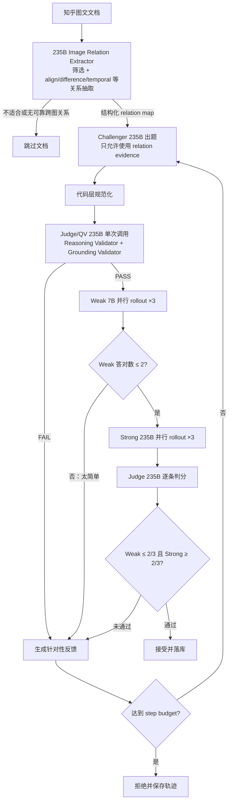

# 多图 MCQ：模型选型、出题、评判与多轮 Rollout

> 更新时间：2026-07-21  
> 适用范围：知乎图文语料 → 五选一多图理解题（MCQ）  
> 相关总计划：[PLAN_mcq_pipeline.md](./PLAN_mcq_pipeline.md)

## 1. 目标

流水线从一篇知乎回答的原始文本和多张图片中生成一道五选一题。题目必须依赖至少两张图片，不能仅靠原文、常识或单张图片作答。

系统不以“模型生成了一道题”作为完成条件，而是要求：

- 强模型能够稳定答对；
- 弱模型不能过于稳定地答对；
- 独立质量验证器确认题目有唯一且有视觉证据支持的答案；
- 不满足要求时，将具体失败原因反馈给出题模型，换一个推理角度重新生成。

## 2. 四个角色与模型选型

| 角色 | 当前模型 | 本地端口 | 主要职责 | 选择原因 |
|---|---|---:|---|---|
| Challenger | Qwen3-VL-235B-A22B-Instruct | `8007` | 阅读原始图文，生成题干、选项和候选标准答案 | 当前对比批次 clean acceptance 为 85%，且答案字母分布更均衡 |
| Weak Solver | Qwen2.5-VL-7B | `8004` | 只看图片和题面，独立解题 | 视觉能力较弱，适合作为难度下界；五选一存在约 20% 随机猜测底噪 |
| Strong Solver | Qwen3-VL-235B-A22B-Instruct | `8005` | 只看图片和题面，独立解题 | 当前最强视觉判别模型，用于确认题目确实可解 |
| Judge / QV | Qwen3-VL-235B-A22B-Instruct | `8005` | 题目质量检查、答案唯一性验证、每次 rollout 打分 | 7B 做视觉质检容易误判；235B 更能识别答案泄漏、缺图和伪多图题 |

当前 `8005` 经 SSH 端口 `57148` 转发到 Strong 服务，`8007` 经 SSH 端口 `10656`
转发到 Challenger 服务；两者均为 `qwen3-vl-235b`。历史 122B Challenger 使用 `8006`。

推荐推理参数：

| 角色 | temperature | max_tokens | rollout 数 |
|---|---:|---:|---:|
| Challenger | `0.5` | `2048` | 每轮 1 次 |
| Weak | `0.7` | 按简短回答限制 | `k_weak=3` |
| Strong | `0.2–0.7` | 按简短回答限制 | `k_strong=3` |
| Judge / QV | `0` | 尽量短的结构化输出 | 每个候选及每条回答各 1 次 |

Challenger 建议关闭 thinking，以减少冗长输出和 JSON 格式错误。Judge 使用温度 0，使同一答案的评判尽量可复现。

## 3. 完整工作流程



默认每个文档最多生成 `step_budget=4` 轮。每一轮都会生成一个新候选，而不是简单重复采样同一道坏题。

## 4. 出题阶段

### 4.1 输入

Challenger 可以看到：

- 知乎回答的原始文本；
- 按阅读顺序排列的多张图片；
- MCQ 任务类型约束；
- 前一轮的失败反馈（第一轮为空）。
- Relation Extractor 缓存的 `relation_map`：相关图片、关系类型、可见证据、允许语义和禁止推断。

Relation Extractor 取代旧的 yes/no Visual Gate，同一次 235B 调用同时完成素材筛选与
`align / difference / temporal / spatial / correspondence / progression` 等关系抽取。
关系结果按文档缓存，多轮 Challenger 重写不会重复分析图片，因此没有额外 Gate 调用。

Extractor 同时执行图片裁剪：`relevant_images` 必须等于有效 relations 使用图片的并集。
封面、装饰图、重复图和不参与关系的截图会在 Challenger 之前移除；剩余图片重新连续编号，
原始图号保存在 `source_image_indices`。Challenger、QV、Weak/Strong 和最终数据只接收裁剪后的图片。

Weak 和 Strong 不可看到知乎原文，只能看到图片和最终题面，避免原文直接泄漏答案。

### 4.2 出题硬约束

题目必须：

1. 显式依赖至少两张图片；
2. 单张图片不足以作答；
3. 不能只靠常识或知乎原文作答；
4. 测试比较、多跳推理、图表联读、时序、匹配等能力，而非简单文字召回；
5. 只有一个正确选项；
6. 干扰项是与图片有关的近似错误，而不是一眼可排除的胡乱选项。
7. 题目只能使用 `relation_map` 中列出的关系和证据；没有图内明确标签时，不得从图标
   外观推断游戏装备类别、商品功能、医学诊断、品牌或物种等世界知识。
8. 每张保留图片必须参与至少一条有效跨图 relation；不得用无关图片凑多图数量。

推荐任务类型包括：`multi_hop`、`comparison`、`chart_table`、`temporal_order`、`comprehensive`、`retrieval_matching`、`difference_spotting` 和 `multi_view_spatial`。

### 4.3 Challenger 输出

```json
{
  "question": "题干",
  "options": ["A. ...", "B. ...", "C. ...", "D. ...", "E. Cannot be determined ..."],
  "correct_answer": "C",
  "answerable": true,
  "task_type": "comparison",
  "reference_answer": "The correct answer is option C.",
  "rubric": [
    {"number": 1, "criterion": "The final selected option is C", "weight": 10}
  ]
}
```

标准答案最初由 Challenger **提出**，但不能直接视为真值；后续还要经过代码同步、QV 验证和 Strong 独立作答验证。

## 5. 代码层规范化

模型输出后必须执行确定性的代码处理：

1. **补齐 E 选项**：保留四个实质选项，E 固定为证据不足；实质选项少于四个则本轮失败。
2. **随机化答案位置**：打乱 A–D 的内容，消除 Challenger 把答案集中放在 A 的偏差。
3. **重新标注字母**：打乱后重新计算 `correct_answer`。
4. **强制同步**：将 `reference_answer` 和 rubric 中的答案字母同步到新位置。
5. **拼接完整题面**：将题干与 A–E 选项组合后发送给两个 Solver。

这些约束由代码保证，不能只依赖提示词。

## 6. Quality Verifier 如何评判题目

QV 由 235B 执行，在 Solver 作答前检查候选题。对 MCQ 只重点检查：

1. **视觉可验证性**：每个选项都能从给定图片中确认或否定，不能依赖隐藏原文；
2. **答案唯一性**：标注答案确实正确，而且不存在第二个同样正确的选项；
3. **无题干泄漏**：不看图片时，不能仅凭题面措辞或选项风格猜出答案；
4. **真实多图依赖**：回答确实需要至少两张图；
5. **图片引用有效**：题目引用的图片实际存在。
6. **Reasoning Validation**：推理必须使用 relation map 中的一条跨图关系，且不能退化为单图查询；
7. **Grounding Validation**：A–D 每个事实都必须映射到像素、图中文字或明确结构；
8. **World-knowledge Validation**：禁止把颜色/形状直接解释成未标注的名称、功能或类别。

以上三类验证仍在同一次 QV 调用中完成。存在 `relation_map` 时，`reasoning`、
`grounding`、`world_knowledge` 三项必须全部明确为 `PASS`；缺失任一项都会由代码强制拒绝。

QV 输出 `PASS` 或 `FAIL`，并给出反馈。FAIL 时不运行 Solver，反馈直接进入下一轮 Challenger，例如：

- “第三张图不存在”；
- “A 和 C 都可以成立，答案不唯一”；
- “只看第一张图即可回答”；
- “正确选项使用了原文信息，图片中没有证据”。

## 7. 多轮 Rollout 如何运行

### 7.1 一轮和一次 rollout 的区别

- **一轮 round**：Challenger 生成一道新题，经过完整 QV、Weak、Strong 和 Judge 流程。
- **一次 rollout**：某个 Solver 对同一道题进行一次独立作答。

当前每一轮运行 Weak 3 次、Strong 3 次。多次 rollout 用来衡量模型是否稳定会做，而不是依赖单次偶然答案。

### 7.2 Weak rollout

QV 通过后，并行运行：

```text
Weak-1 ─┐
Weak-2 ─┼─→ Judge 分别判断对错 → weak_correct
Weak-3 ─┘
```

如果 Weak 答对超过 2 次，说明题目对弱模型太简单。本轮标记为 `too_easy`，跳过昂贵的 Strong rollout，并把“需要更深的跨图推理”反馈给 Challenger。

### 7.3 Strong rollout

只有 Weak 门控通过后才运行：

```text
Strong-1 ─┐
Strong-2 ─┼─→ Judge 分别判断对错 → strong_correct
Strong-3 ─┘
```

Strong 至少答对 2 次，才认为题目具有足够稳定的可解性。若 Strong 多次失败，可能是标准答案错误、证据不足、题面歧义或题目过难。

## 8. Judge 如何给每条回答判分

Solver 必须以 `Final answer: <letter>` 结束。Judge 同时看到：

- 图片；
- 完整题面；
- 标准答案对应的 rubric；
- 某一次 Solver 回答。

MCQ 使用可验证的二值判分：最终字母与规范化后的标准答案一致记为 1，否则为 0。每条 rollout 独立判定，然后统计：

```text
weak_avg   = weak_correct / 3
strong_avg = strong_correct / 3
gap        = strong_avg - weak_avg
```

默认接收条件：

```text
weak_correct   ≤ 2
strong_correct ≥ 2
```

满足条件表示“强模型大体会做、弱模型不能稳定做对”。未满足时，Judge 或流程生成针对性建议并进入下一轮。

## 9. 多轮反馈与终止条件

| 失败点 | 决策 | 给 Challenger 的下一轮反馈 |
|---|---|---|
| Challenger 输出异常 | `challenger_error` | 修复 JSON、补齐字段、缩短输出 |
| QV 不通过 | `qv_fail` | 按 QV 指出的泄漏、歧义、缺图问题重写 |
| Weak 过强 | `too_easy` | 换更深的跨图推理角度，提高难度 |
| Strong 答错过多 | `improve` | 修正答案或视觉证据，降低歧义，确保可解 |
| Gap 达标 | `accept` | 落库并停止该文档循环 |
| 达到 step budget | `rejected` | 保存完整失败轨迹，不导出为训练样本 |

下一轮 Challenger 会收到上一轮反馈，并应从不同推理角度重新出题。所有 round、rollout、答案、分数和失败原因都会持久化，便于复核。

## 10. 标准答案的责任链

```text
Challenger 提出答案
        ↓
代码随机化选项并同步答案字母
        ↓
235B QV 检查图片证据与答案唯一性
        ↓
235B Strong 独立作答 3 次验证可解性
        ↓
235B Judge 对每次回答判分
        ↓
达到 gap 条件后才接受
```

因此，答案不是由单个模型一次性决定：Challenger 是答案提议者，代码保证内部一致，QV 和 Strong/Judge 构成验证链。由于 Strong 与 Judge 当前使用同一个 235B 模型，仍可能存在同模型偏差；规模化导出前应对 accepted 数据进行人工抽检，未来有条件时可使用独立模型担任 Judge。

## 11. Unanswerable 题

E 必须区分两种语义：图片可回答但 A–D 全错时，使用
`answer_type=none_of_above` 和 `E. None of the above is correct`；只有图片确实缺少作答证据时，
才使用 `answer_type=insufficient_evidence` 和 `E. Cannot be determined from the given images`。

当前“改坏正确选项文字”的方法容易被 QV 识别。计划改为图片替换法：由 Challenger 标注关键证据图，将其替换为同域但无关的图片，再由 235B 验证证据确实不足。该改造尚未完成。

## 12. 当前限制

- Strong 与 Judge 共用 235B，存在自我一致性偏差。
- 235B 解码较慢，应严格限制输出长度；门控只需极短 JSON。
- 五选一有随机猜测底噪，因此不能要求 Weak 三次全错。
- 只有完成 Strong rollout 的轮次才有完整 weak/strong 分离度数据；QV 提前拒绝的轮次没有 Solver 分数。
- 自动验证不能完全替代人工复核，尤其是细粒度 OCR、专业图表和 unanswerable 样本。
